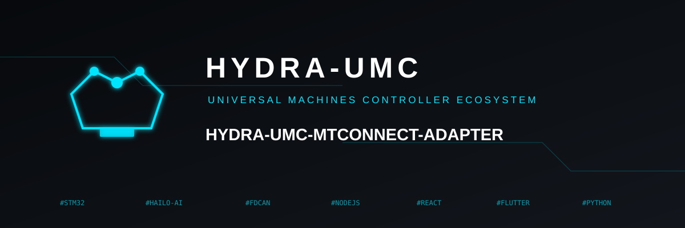

<p align="center">
  
</p>

# 🏭 HYDRA-UMC-MTCONNECT-ADAPTER

<p align="center">🇺🇸 <b>English</b> | <a href="README_spa.md">🇪🇸 Español</a> | <a href="README_fra.md">🇫🇷 Français</a> | <a href="README_ita.md">🇮🇹 Italiano</a> | <a href="README_deu.md">🇩🇪 Deutsch</a> | <a href="README_zho.md">🇨🇳 简体中文</a> | <a href="README_jpn.md">🇯🇵 日本語</a></p>

### 🛠️ Standardized XML/HTTP Interface for Machine Tool Monitoring

<p align="left">
  
  
  
</p>

---

## 1. 🛠️ TECHNICAL OVERVIEW

**HYDRA-UMC-MTCONNECT-ADAPTER** is the legacy and factory-standard bridge for machine tool monitoring. It implements the MTConnect protocol (ANSI/MTC1.4), exposing the robotic swarm as a set of standardized machine tools.

It provides a read-only XML/HTTP interface that allows traditional industrial software to monitor the execution state, tool positions, and sensor data of every HydraNode without needing specialized drivers.

### Key Features:
* 🏭 **Standardized Machine Data:** Exposes Hydra robots as MTConnect-compliant devices.
* 📄 **XML Data Streams:** Periodic and event-driven updates in standard XML format.
* 🌐 **HTTP Interface:** Accessible via simple RESTful queries for easy integration.
* 🔍 **Agent Compatibility:** Works seamlessly with existing MTConnect Agents and collectors.
* 📐 **Real Unit/Quality Mapping:** Every DataItem's native unit, quality, UTC timestamp and error code are computed by a real, versioned mapping - testable without hardware. *(implemented)*
* 🩹 **Degraded-Mode Output:** A source that's down or reports invalid data renders MTConnect's own real `UNAVAILABLE` value with an error code, not a crash or stale data. *(implemented)*

---

## 2. 🔄 MTCONNECT DATA FLOW


---

## 3. 🧱 ARCHITECTURE & DESIGN DECISIONS

* **Why this is a sibling, not a submodule, of HYDRA-UMC-GATEWAY-INDUSTRIAL.** Each protocol adapter is a separately deployable/restartable process - an MTConnect XML-generation issue never takes down the OPC-UA or MQTT adapters running alongside it.
* **Why a real MTConnect device/agent stream, not a generic XML export.** MTConnect-aware factory software (many CNC/MES tools) expects the specific device/agent/component schema the standard defines - a generic export would need a custom parser on the other end, defeating the point of speaking MTConnect.
* **Why the entry point only prints identity/version, exits after a health-check listener comes up.** Andamiaje (scaffolding) stage, same reasoning as the parent's own README - a real adapter is long-running by nature.
* **How this fits the rest of the ecosystem.** A sibling service under HYDRA-UMC-GATEWAY-INDUSTRIAL - translates HYDRA-UMC-SERVER's own state into a real MTConnect device/agent feed.
* **Real HTTP tests, not just a compile check.** `tests/server.test.ts` uses `supertest` (a real HTTP request over a real listening socket) to verify `GET /probe` and `GET /current` return spec-shaped XML with matching namespaces, consistent `Device`/`DataItem` ids between the two documents, and a shared `instanceId`.
* **Why unit conversion, quality classification, and reading a machine are three separate modules.** `src/units.ts` (pure conversion math), `src/dataitem.ts` (quality/timestamp/error-code mapping) and `src/reader.ts` (polling/caching a `MachineReader`) are each testable on their own, without hardware or HTTP - the promotion audit's own concern: unit-conversion bugs found through a full HTTP round trip are slow to isolate and easy to miss.
* **Why a degraded DataItem renders MTConnect's real `UNAVAILABLE` value, not a custom error shape.** MTConnect Agents and collectors already know how to display `UNAVAILABLE` - reusing the spec's own vocabulary means a real downstream tool degrades gracefully today, not once it's taught a HYDRA-UMC-specific convention. The `errorCode` attribute (`NO_DATA`/`UNIT_CONVERSION_ERROR`/`SOURCE_UNAVAILABLE`) is this project's own v0 addition for real diagnosis, documented as such rather than presented as a standard MTConnect attribute.
* **Why `CachedReader`'s polling limit is generic, not hardcoded to `spindle_temp`.** No real machine source exists in this environment yet, but the real risk it guards against - hammering a decades-old controller with requests every time `/current` is hit - applies to whatever source eventually replaces `FixtureMachineReader`, so the throttle lives at the `MachineReader` interface level, not inside one DataItem's own handling.

---

## 📂 DIRECTORY STRUCTURE

```text
HYDRA-UMC-MTCONNECT-ADAPTER/
├── src/         # Source code (Node/TypeScript - Adapter, Mapper, HTTP)
├── tests/       # Vitest suite - data-item mapping, units, reader, and server behavior
├── docs/
│   └── API.md   # Real HTTP endpoint reference (requests, responses, XML shape)
├── build/       # Compiled output (npm run build)
├── images/      # Media and diagrams
├── scripts/     # Utility scripts (bump-version.mjs)
├── tools/       # ci_validate.py - manifest/CHANGELOG/docs validation used by CI
└── README.md
```

Pure network service, no dedicated hardware of its own - `hardware/`,
`firmware/` and `os/` are omitted under the repository structure policy.
See [`docs/API.md`](docs/API.md) for the full HTTP endpoint reference.

---

## 🛠️ DEVELOPMENT ENVIRONMENT

### Requirements
- [Node.js](https://nodejs.org/) (v18 or higher recommended)
- npm

### Installation
```bash
npm install
```

### Development Mode
Runs the adapter directly with `tsx` (no bundler):
- **Windows:** double-click `dev.bat` or run `npm run dev`
- **Linux/Mac:** run `./dev.sh` or `npm run dev`

### Production Build
Bundles the adapter into a single deployable file with esbuild:
- **Windows:** double-click `build.bat` or run `npm run build`
- **Linux/Mac:** run `./build.sh` or `npm run build`

Then start it with:
```bash
npm start
```

The adapter listens on `0.0.0.0:5000` - any MTConnect Agent/collector can
query `GET http://<host>:5000/probe` (static device model) and
`GET http://<host>:5000/current` (latest DataItem values).

### Versioning
Every real `npm run build` bumps `package.json`'s own `version`
automatically (`scripts/bump-version.mjs`, wired as the first step of the
`build` script) - a base-10 "odometer": patch +1 per build, rolling over
into minor (and minor into major) past 9 rather than ever reaching a
two-digit segment (`0.0.9` -> `0.1.0`, not `0.0.10`).

---

## 🚀 ROADMAP
* **Phase 1:** OPC-UA Pub/Sub implementation for high-speed data exchange and legacy protocol bridging.
* **Phase 2:** MQTT Broker cluster for massive IoT device management and high concurrency.
* **Phase 3:** MTConnect adapter support for multi-vendor CNC and PLC machinery integration.
* **Phase 4:** Support for MTConnect multi-device aggregation and standardized XML/HTTP telemetry streaming.

---

## 🔗 Related Projects

This project is part of the HYDRA-UMC robotics ecosystem by the same author (JuanenRac / Electro Hobby 3D). Worth knowing about, since a request might actually be about one of these rather than this repository.

**Parent Project**
- **[HYDRA-UMC-GATEWAY-INDUSTRIAL](https://github.com/JuanenRac/HYDRA-UMC-GATEWAY-INDUSTRIAL)** — integration hub relaying to industrial protocols, with a real command allowlist/backpressure layer; the parent this repo is one specific protocol adapter of, within its own industrial gateway.

**Sibling Projects** — the other protocol adapters of HYDRA-UMC-GATEWAY-INDUSTRIAL's own industrial gateway
- **[HYDRA-UMC-OPCUA-SERVER](https://github.com/JuanenRac/HYDRA-UMC-OPCUA-SERVER)** — real OPC-UA address space, verified with a real binary-protocol client session.
- **[HYDRA-UMC-MQTT-BROKER](https://github.com/JuanenRac/HYDRA-UMC-MQTT-BROKER)** — real MQTT broker with optional per-client authentication and topic ACLs.

**Directly Related**
- **[HYDRA-UMC-SERVER](https://github.com/JuanenRac/HYDRA-UMC-SERVER)** — the real headless backend (REST/WebSocket) every control client actually talks to — the source of the state this adapter exposes.

**Also Part of the Ecosystem**

*Core Hardware & Platform*
- **[HYDRA-UMC](https://github.com/JuanenRac/HYDRA-UMC)** — the physical robot-arm motherboard: CM5 host + dual-core STM32H745, orchestrating up to 8 tool arms over CAN-OTA/SPI-OTA.
- **[HYDRA-UMC-OS](https://github.com/JuanenRac/HYDRA-UMC-OS)** — reproducible Raspberry Pi OS product layer for the CM5: read-only agent, validated config/profiles, WiFi first-contact provisioning.
- **[HYDRA-UMC-SDK](https://github.com/JuanenRac/HYDRA-UMC-SDK)** — the shared JSON-Schema contract and safety-gate boundary every bridge validates its commands against.

*Core Backend & Clients*
- **[HYDRA-UMC-STUDIO](https://github.com/JuanenRac/HYDRA-UMC-STUDIO)** — web control dashboard with real-time multi-robot 3D visualization.
- **[HYDRA-UMC-SUITE](https://github.com/JuanenRac/HYDRA-UMC-SUITE)** — desktop (PySide6) swarm command center for multiple servers at once, packaged as a standalone executable.
- **[HYDRA-UMC-ANDROID-CONTROL](https://github.com/JuanenRac/HYDRA-UMC-ANDROID-CONTROL)** — native Android control app with biometric login and a paired Wear OS companion.
- **[HYDRA-UMC-IOS-CONTROL](https://github.com/JuanenRac/HYDRA-UMC-IOS-CONTROL)** — iOS/iPadOS control app (Flutter) with real-time WebSocket sync.
- **[HYDRA-UMC-DSI](https://github.com/JuanenRac/HYDRA-UMC-DSI)** — native touch UI for the onboard 7" DSI touchscreen, embedded on the CM5 itself.
- **[HYDRA-UMC-EDITOR-URDF](https://github.com/JuanenRac/HYDRA-UMC-EDITOR-URDF)** — desktop graphical URDF creator/editor that pushes finished models into STUDIO's own catalog.
- **[HYDRA-UMC-BRIDGE-AMR](https://github.com/JuanenRac/HYDRA-UMC-BRIDGE-AMR)** — coordination boundary for AGV/AMR fleets via a real VDA 5050 MQTT publisher.
- **[HYDRA-UMC-BRIDGE-CNC](https://github.com/JuanenRac/HYDRA-UMC-BRIDGE-CNC)** — high-level CNC-cell coordinator with real GRBL status/control-byte access.
- **[HYDRA-UMC-BRIDGE-DROIDS](https://github.com/JuanenRac/HYDRA-UMC-BRIDGE-DROIDS)** — coordination boundary for legged/humanoid droids, with a real Boston Dynamics Spot command sender.
- **[HYDRA-UMC-BRIDGE-LASER](https://github.com/JuanenRac/HYDRA-UMC-BRIDGE-LASER)** — laser-cell safety coordinator reading 3 real key/enclosure/interlock GPIO safeguards.
- **[HYDRA-UMC-BRIDGE-OPENPNP](https://github.com/JuanenRac/HYDRA-UMC-BRIDGE-OPENPNP)** — safe high-level board-flow coordinator for OpenPnP pick-and-place.
- **[HYDRA-UMC-BRIDGE-PRINTER3D](https://github.com/JuanenRac/HYDRA-UMC-BRIDGE-PRINTER3D)** — safe coordination boundary for Moonraker/Klipper 3D printers, with real gated job commands.
- **[HYDRA-UMC-BRIDGE-ROS2](https://github.com/JuanenRac/HYDRA-UMC-BRIDGE-ROS2)** — safety coordinator with a real, lazily-imported rclpy ROS 2 transport.
- **[HYDRA-UMC-BRIDGE-UAV](https://github.com/JuanenRac/HYDRA-UMC-BRIDGE-UAV)** — coordination boundary for camera-equipped UAVs, with a real MAVLink command sender.

*URTC Tool Platform*
- **[URTC](https://github.com/JuanenRac/URTC)** — firmware for the physical Universal Robot Tool Controller PCB, 25+ tool profiles over CAN bus.
- **[URTC-FLASHER](https://github.com/JuanenRac/URTC-FLASHER)** — desktop GUI flashing tool for URTC boards, CAN-OTA plus full-chip SWD/JTAG.
- **[URTC-TESTER](https://github.com/JuanenRac/URTC-TESTER)** — desktop live CAN-bus diagnostic tool for URTC boards, one panel per tool profile.
- **[URTC-WEB-STUDIO](https://github.com/JuanenRac/URTC-WEB-STUDIO)** — browser-based alternative to URTC-TESTER via the Web Serial API, no local install needed.

*Vision AI Node (Hailo-8)*
- **[HYDRA-UMC-VISION-NODE](https://github.com/JuanenRac/HYDRA-UMC-VISION-NODE)** — integration hub for the Hailo-8 vision pipeline, with a real per-stage hardware-readiness check.
- **[HYDRA-UMC-DETECTION-HEF](https://github.com/JuanenRac/HYDRA-UMC-DETECTION-HEF)** — real compiled-model registry with Hailo-architecture/checksum safe-load verification.
- **[HYDRA-UMC-VISION-STREAMER](https://github.com/JuanenRac/HYDRA-UMC-VISION-STREAMER)** — real GStreamer pipeline + MediaMTX config generator with a real HailoRT integration boundary.
- **[HYDRA-UMC-VISUAL-SERVOING-API](https://github.com/JuanenRac/HYDRA-UMC-VISUAL-SERVOING-API)** — real Position-Based Visual Servoing correction law, safety-gated on upstream zone state.
- **[HYDRA-UMC-SAFETY-ZONES](https://github.com/JuanenRac/HYDRA-UMC-SAFETY-ZONES)** — real zone-breach checking and E-STOP requesting, with calibration-freshness enforcement.

*Cognitive AI Node (Hailo-10)*
- **[HYDRA-UMC-COGNITIVE-NODE](https://github.com/JuanenRac/HYDRA-UMC-COGNITIVE-NODE)** — integration hub for the Hailo-10 cognitive pipeline (LLM/VLA/voice orchestration).
- **[HYDRA-UMC-VLA-ENGINE](https://github.com/JuanenRac/HYDRA-UMC-VLA-ENGINE)** — real action-token encoding/decoding and trajectory generation for a Vision-Language-Action model.
- **[HYDRA-UMC-VOICE-UI](https://github.com/JuanenRac/HYDRA-UMC-VOICE-UI)** — real voice front-end (VAD + intent parser) with a bounded, confirmation-gated Watch relay.
- **[HYDRA-UMC-SEMANTIC-PLANNER](https://github.com/JuanenRac/HYDRA-UMC-SEMANTIC-PLANNER)** — real rule-based task decomposition and semantic error recovery over MCU error codes.
- **[HYDRA-UMC-DOCS-QA](https://github.com/JuanenRac/HYDRA-UMC-DOCS-QA)** — real stdlib-only TF-IDF document search over this ecosystem's own Markdown docs.

*Orchestration & Swarm*
- **[HYDRA-UMC-ORCHESTRATOR](https://github.com/JuanenRac/HYDRA-UMC-ORCHESTRATOR)** — integration hub with a real gRPC/Protobuf health-report contract and mission state machine.
- **[HYDRA-UMC-JOB-DISPATCHER](https://github.com/JuanenRac/HYDRA-UMC-JOB-DISPATCHER)** — real priority-based job queue with deduplication, over a real HTTP API.
- **[HYDRA-UMC-NODE-HEALING](https://github.com/JuanenRac/HYDRA-UMC-NODE-HEALING)** — real gRPC-based fleet health watchdog with retry/backoff and identity-mismatch detection.
- **[HYDRA-UMC-PATH-PLANNER-3D](https://github.com/JuanenRac/HYDRA-UMC-PATH-PLANNER-3D)** — real RRT-based 3D path planner with real obstacle/workspace collision validation.
- **[HYDRA-UMC-SWARM-SYNC](https://github.com/JuanenRac/HYDRA-UMC-SWARM-SYNC)** — real CRDT LWW-Element-Map state sync, property-tested for multi-cell convergence.

*Digital Twin & Simulation*
- **[HYDRA-UMC-TWIN](https://github.com/JuanenRac/HYDRA-UMC-TWIN)** — integration hub for the digital-twin engine, with a real version-compatibility sync contract.
- **[HYDRA-UMC-HIL-BRIDGE](https://github.com/JuanenRac/HYDRA-UMC-HIL-BRIDGE)** — real hardware-in-the-loop safety interlock routing commands between simulation and real hardware.
- **[HYDRA-UMC-PHYSICS-REPLICA](https://github.com/JuanenRac/HYDRA-UMC-PHYSICS-REPLICA)** — real forward kinematics and joint-limit validation over a real URDF subset.
- **[HYDRA-UMC-SYNTHETIC-DATA-GEN](https://github.com/JuanenRac/HYDRA-UMC-SYNTHETIC-DATA-GEN)** — real procedural 2D scene generator with YOLO/COCO annotation export.

*Data & Analytics*
- **[HYDRA-UMC-DATALAKE](https://github.com/JuanenRac/HYDRA-UMC-DATALAKE)** — real sqlite3-backed time-series store with a real ingest/query HTTP API.
- **[HYDRA-UMC-ANOMALY-DETECTOR](https://github.com/JuanenRac/HYDRA-UMC-ANOMALY-DETECTOR)** — real FFT + statistical baseline anomaly detector with drift monitoring.
- **[HYDRA-UMC-PRODUCTION-REPORTS](https://github.com/JuanenRac/HYDRA-UMC-PRODUCTION-REPORTS)** — real OEE/availability calculation over DATALAKE history, with reproducible CSV export.
- **[HYDRA-UMC-TELEMETRY-COLLECTOR](https://github.com/JuanenRac/HYDRA-UMC-TELEMETRY-COLLECTOR)** — real CAN/WebSocket ingestion pipeline into DATALAKE, with sequence deduplication.

*Complementary Tools & Ecosystem Operations*
- **[HYDRA-UMC-DASHBOARD-AI](https://github.com/JuanenRac/HYDRA-UMC-DASHBOARD-AI)** — Smart Summaries and Anomaly Highlighting panels over DATALAKE/ANOMALY-DETECTOR, with an honest statistical fallback.
- **[HYDRA-UMC-TOOL-CLI](https://github.com/JuanenRac/HYDRA-UMC-TOOL-CLI)** — fleet CLI with a real, stable exit-code contract, a genuine live client of HYDRA-UMC-SERVER's own API.
- **[HYDRA-UMC-WATCH](https://github.com/JuanenRac/HYDRA-UMC-WATCH)** — WearOS companion app with real haptic alerts and a paired-phone voice relay.
- **[URTC-SMART-RACK](https://github.com/JuanenRac/URTC-SMART-RACK)** — firmware for a board-mounting rack with real tool-ID decoding and Smart Idle pre-heating logic.
- **[URTC-VISION-TOOL](https://github.com/JuanenRac/URTC-VISION-TOOL)** — firmware plus a real Python vision companion for a thermal/RGB inspection tool head.
- **[HYDRA-UMC-UPDATER](https://github.com/JuanenRac/HYDRA-UMC-UPDATER)** — administrative desktop tool that discovers, clones and updates every repo in this ecosystem.


---

## 📚 Documentation & Community

- **[CONTRIBUTING.md](CONTRIBUTING.md)** — tech stack and coding guidelines for a pull request.
- **[CODE_OF_CONDUCT.md](CODE_OF_CONDUCT.md)** — the standards of behavior expected in this community.
- **[SECURITY.md](SECURITY.md)** — how to report a vulnerability, and this project's own real security focus areas.
- **[SUPPORT.md](SUPPORT.md)** — where to ask questions and report bugs.
- **[LICENSE.md](LICENSE.md)** — this project's own license.

## 👤 AUTHOR
**JuanenRac** (Electro Hobby 3D)
📧 electrohobby3d@gmail.com
📺 [youtube.com/@electrohobby3d](https://youtube.com/@electrohobby3d)

## 📜 LICENSE
GPL-3.0 - See LICENSE for details.
