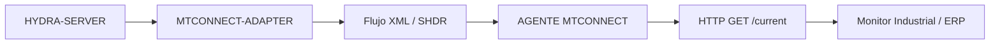

<p align="center">
  
</p>

# 🏭 HYDRA-UMC-MTCONNECT-ADAPTER

<p align="center"><a href="README.md">🇺🇸 English</a> | 🇪🇸 <b>Español</b> | <a href="README_fra.md">🇫🇷 Français</a> | <a href="README_ita.md">🇮🇹 Italiano</a> | <a href="README_deu.md">🇩🇪 Deutsch</a> | <a href="README_zho.md">🇨🇳 简体中文</a> | <a href="README_jpn.md">🇯🇵 日本語</a></p>

### 🛠️ Interfaz XML/HTTP Estandarizada para Monitorización de Máquinas Herramienta

<p align="left">
  
  
  
</p>

---

## 1. 🛠️ VISIÓN GENERAL TÉCNICA

**HYDRA-UMC-MTCONNECT-ADAPTER** es el puente estándar de fábrica y legado para la monitorización de máquinas herramienta. Implementa el protocolo MTConnect (ANSI/MTC1.4), exponiendo el enjambre robótico como un conjunto de máquinas herramienta estandarizadas.

Proporciona una interfaz XML/HTTP de solo lectura que permite que el software industrial tradicional monitorice el estado de ejecución, las posiciones de las herramientas y los datos de los sensores de cada HydraNode sin necesidad de drivers especializados.

### Características Clave:
* 🏭 **Datos de Máquina Estandarizados:** Expone los robots Hydra como dispositivos compatibles con MTConnect.
* 📄 **Flujos de Datos XML:** Actualizaciones periódicas y basadas en eventos en formato XML estándar.
* 🌐 **Interfaz HTTP:** Accesible a través de simples consultas RESTful para una fácil integración.
* 🔍 **Compatibilidad con Agentes:** Funciona perfectamente con Agentes y colectores MTConnect existentes.
* 📐 **Mapeo Real de Unidad/Calidad:** La unidad nativa, la calidad, el timestamp UTC y el código de error de cada DataItem se calculan mediante un mapeo real y versionado - testeable sin hardware. *(implementado)*
* 🩹 **Salida en Modo Degradado:** Una fuente caída o que reporta datos inválidos renderiza el propio valor real `UNAVAILABLE` de MTConnect junto con un código de error, no un crash ni datos obsoletos. *(implementado)*

---

## 2. 🔄 FLUJO DE DATOS MTCONNECT



---

## 3. 🧱 ARQUITECTURA Y DECISIONES DE DISEÑO

* **Por qué es hermano, no un submódulo, de HYDRA-UMC-GATEWAY-INDUSTRIAL.** Cada adaptador de protocolo es un proceso desplegable/reiniciable por separado - un problema en la generación de XML de MTConnect nunca tumba los adaptadores de OPC-UA o MQTT que corren junto a él.
* **Por qué un flujo real de dispositivo/agente MTConnect, no una exportación XML genérica.** El software de planta compatible con MTConnect (muchas herramientas CNC/MES) espera el esquema específico de dispositivo/agente/componente que define el estándar - una exportación genérica necesitaría un parser a medida en el otro extremo, anulando el sentido de hablar MTConnect.
* **Por qué el punto de entrada solo imprime identidad/versión, y termina tras levantar un listener de health-check.** Etapa de andamiaje, mismo motivo que el propio README del padre - un adaptador real es de larga duración por naturaleza.
* **Cómo encaja en el resto del ecosistema.** Un servicio hermano bajo HYDRA-UMC-GATEWAY-INDUSTRIAL - traduce el propio estado de HYDRA-UMC-SERVER a un flujo real de dispositivo/agente MTConnect.
* **Tests HTTP reales, no solo una comprobación de compilación.** `tests/server.test.ts` usa `supertest` (una petición HTTP real sobre un socket real y en escucha) para verificar que `GET /probe` y `GET /current` devuelven XML con la forma correcta del spec, con namespaces coincidentes, ids de `Device`/`DataItem` consistentes entre ambos documentos, y un `instanceId` compartido.
* **Por qué la conversión de unidades, la clasificación de calidad y la lectura de una máquina son tres módulos separados.** `src/units.ts` (matemática de conversión pura), `src/dataitem.ts` (mapeo de calidad/timestamp/código de error) y `src/reader.ts` (sondeo/cacheo de un `MachineReader`) son cada uno testeable por separado, sin hardware ni HTTP - la propia preocupación de la auditoría de promoción: los bugs de conversión de unidades encontrados a través de un round trip HTTP completo son lentos de aislar y fáciles de pasar por alto.
* **Por qué un DataItem degradado renderiza el propio valor real `UNAVAILABLE` de MTConnect, y no una forma de error personalizada.** Los Agentes y colectores MTConnect ya saben mostrar `UNAVAILABLE` - reutilizar el propio vocabulario del spec significa que una herramienta downstream real se degrada con elegancia hoy mismo, no una vez que se le enseñe una convención específica de HYDRA-UMC. El atributo `errorCode` (`NO_DATA`/`UNIT_CONVERSION_ERROR`/`SOURCE_UNAVAILABLE`) es la propia adición v0 de este proyecto para un diagnóstico real, documentado como tal en lugar de presentarse como un atributo estándar de MTConnect.
* **Por qué el límite de sondeo de `CachedReader` es genérico, no está fijado a `spindle_temp`.** No existe todavía ninguna fuente de máquina real en este entorno, pero el riesgo real contra el que protege - saturar a golpe de peticiones un controlador de décadas de antigüedad cada vez que se consulta `/current` - aplica a cualquier fuente que eventualmente reemplace a `FixtureMachineReader`, así que el límite vive a nivel de la interfaz `MachineReader`, no dentro del manejo propio de un único DataItem.

---

## 📂 ESTRUCTURA DE DIRECTORIOS

```text
HYDRA-UMC-MTCONNECT-ADAPTER/
├── src/         # Código fuente (Node/TypeScript - Adaptador, Mapeador, HTTP)
├── docs/        # Documentación y guías de configuración
├── build/       # Salida compilada (npm run build)
├── images/      # Medios y diagramas
├── scripts/     # Scripts de utilidad (bump-version.mjs)
└── README.md
```

Servicio de red puro, sin hardware propio - `hardware/`, `firmware/` y
`os/` se omiten según la política de estructura del repositorio.

---

## 🛠️ ENTORNO DE DESARROLLO

### Requisitos
- [Node.js](https://nodejs.org/) (v18 o superior recomendado)
- npm

### Instalación
```bash
npm install
```

### Modo Desarrollo
Ejecuta el adaptador directamente con `tsx` (sin bundler):
- **Windows:** doble clic en `dev.bat` o ejecutar `npm run dev`
- **Linux/Mac:** ejecutar `./dev.sh` o `npm run dev`

### Build de Producción
Empaqueta el adaptador en un único archivo desplegable con esbuild:
- **Windows:** doble clic en `build.bat` o ejecutar `npm run build`
- **Linux/Mac:** ejecutar `./build.sh` o `npm run build`

Luego arráncalo con:
```bash
npm start
```

El adaptador escucha en `0.0.0.0:5000` - cualquier Agente/colector
MTConnect puede consultar `GET http://<host>:5000/probe` (modelo estático
de dispositivo) y `GET http://<host>:5000/current` (últimos valores de
DataItem).

### Versionado
Cada `npm run build` real incrementa automáticamente el `version` de
`package.json` (`scripts/bump-version.mjs`, primer paso del script
`build`) - un "cuentakilómetros" en base 10: patch +1 por build, con
acarreo a minor (y de minor a major) al pasar de 9 en vez de llegar nunca
a un segmento de dos dígitos (`0.0.9` -> `0.1.0`, no `0.0.10`).

---

## 🚀 HOJA DE RUTA
* **Fase 1:** Implementación de OPC-UA Pub/Sub para intercambio de datos de alta velocidad y puente de protocolos heredados.
* **Fase 2:** Clúster de Broker MQTT para gestión masiva de dispositivos IoT y alta concurrencia.
* **Fase 3:** Soporte del adaptador MTConnect para integración de maquinaria CNC y PLC multi-vendedor.
* **Fase 4:** Soporte para agregación multi-dispositivo MTConnect y streaming de telemetría XML/HTTP estandarizado.

---

## 🔗 Proyectos Relacionados

Este proyecto forma parte de un ecosistema de robótica más amplio del mismo autor (JuanenRac / Electro Hobby 3D), que abarca firmware, software de control, nodos de IA y herramientas de flota. Vale la pena conocerlo, ya que una petición podría en realidad ser sobre uno de estos proyectos en vez de sobre este repositorio.

### Familia

**Padre:** **[HYDRA-UMC-GATEWAY-INDUSTRIAL](https://github.com/JuanenRac/HYDRA-UMC-GATEWAY-INDUSTRIAL)** — el padre de integración al que se conecta este adaptador MTConnect.

**Hermanos:**
- **[HYDRA-UMC-OPCUA-SERVER](https://github.com/JuanenRac/HYDRA-UMC-OPCUA-SERVER)** — adaptador de protocolo hermano, mismo padre.
- **[HYDRA-UMC-MQTT-BROKER](https://github.com/JuanenRac/HYDRA-UMC-MQTT-BROKER)** — adaptador de protocolo hermano, mismo padre.

### Relación Directa (fuera de la familia)

- **[HYDRA-UMC-SERVER](https://github.com/JuanenRac/HYDRA-UMC-SERVER)** — la fuente del estado que expone este adaptador.

### Resto del Ecosistema

**Plataforma HYDRA-UMC** — la célula de micro-fábrica multi-robot
- **[HYDRA-UMC](https://github.com/JuanenRac/HYDRA-UMC)** — la placa base CM5 + STM32H745 que orquesta hasta 8 brazos robóticos.
- **[HYDRA-UMC-SERVER](https://github.com/JuanenRac/HYDRA-UMC-SERVER)** — el backend Express/WebSocket con el que habla cada cliente de control.
- **[HYDRA-UMC-STUDIO](https://github.com/JuanenRac/HYDRA-UMC-STUDIO)** — panel de control web, visualización 3D multi-robot.
- **[HYDRA-UMC-ANDROID-CONTROL](https://github.com/JuanenRac/HYDRA-UMC-ANDROID-CONTROL)** — app de control Android por Wi-Fi/Bluetooth.
- **[HYDRA-UMC-IOS-CONTROL](https://github.com/JuanenRac/HYDRA-UMC-IOS-CONTROL)** — app de control iOS/iPadOS construida en Flutter.
- **[HYDRA-UMC-SUITE](https://github.com/JuanenRac/HYDRA-UMC-SUITE)** — centro de mando de enjambre de escritorio (Python/PySide6).
- **[HYDRA-UMC-EDITOR-URDF](https://github.com/JuanenRac/HYDRA-UMC-EDITOR-URDF)** — editor de modelos URDF de escritorio para el catálogo de robots.
- **[HYDRA-UMC-DSI](https://github.com/JuanenRac/HYDRA-UMC-DSI)** — interfaz táctil nativa para la pantalla DSI integrada.

**Plataforma URTC** — el controlador de cabezal de herramienta que lleva cada brazo HYDRA-UMC
- **[URTC](https://github.com/JuanenRac/URTC)** — controlador de cabezal de herramienta CAN, 25 perfiles de herramienta.
- **[URTC-FLASHER](https://github.com/JuanenRac/URTC-FLASHER)** — herramienta de escritorio de flasheo CAN-OTA + SWD/JTAG.
- **[URTC-TESTER](https://github.com/JuanenRac/URTC-TESTER)** — herramienta de escritorio de diagnóstico CAN en vivo.
- **[URTC-WEB-STUDIO](https://github.com/JuanenRac/URTC-WEB-STUDIO)** — alternativa basada en navegador vía Web Serial API.

**🎥 Vision AI Node (Hailo-8)**
- [HYDRA-UMC-VISION-NODE](https://github.com/JuanenRac/HYDRA-UMC-VISION-NODE)
- [HYDRA-UMC-VISION-STREAMER](https://github.com/JuanenRac/HYDRA-UMC-VISION-STREAMER)
- [HYDRA-UMC-DETECTION-HEF](https://github.com/JuanenRac/HYDRA-UMC-DETECTION-HEF)
- [HYDRA-UMC-SAFETY-ZONES](https://github.com/JuanenRac/HYDRA-UMC-SAFETY-ZONES)
- [HYDRA-UMC-VISUAL-SERVOING-API](https://github.com/JuanenRac/HYDRA-UMC-VISUAL-SERVOING-API)

**🧠 Cognitive AI Node (Hailo-10)**
- [HYDRA-UMC-COGNITIVE-NODE](https://github.com/JuanenRac/HYDRA-UMC-COGNITIVE-NODE)
- [HYDRA-UMC-VLA-ENGINE](https://github.com/JuanenRac/HYDRA-UMC-VLA-ENGINE)
- [HYDRA-UMC-VOICE-UI](https://github.com/JuanenRac/HYDRA-UMC-VOICE-UI)
- [HYDRA-UMC-SEMANTIC-PLANNER](https://github.com/JuanenRac/HYDRA-UMC-SEMANTIC-PLANNER)
- [HYDRA-UMC-DOCS-QA](https://github.com/JuanenRac/HYDRA-UMC-DOCS-QA)

**🐝 Orchestration & Swarm**
- [HYDRA-UMC-ORCHESTRATOR](https://github.com/JuanenRac/HYDRA-UMC-ORCHESTRATOR)
- [HYDRA-UMC-SWARM-SYNC](https://github.com/JuanenRac/HYDRA-UMC-SWARM-SYNC)
- [HYDRA-UMC-PATH-PLANNER-3D](https://github.com/JuanenRac/HYDRA-UMC-PATH-PLANNER-3D)
- [HYDRA-UMC-JOB-DISPATCHER](https://github.com/JuanenRac/HYDRA-UMC-JOB-DISPATCHER)
- [HYDRA-UMC-NODE-HEALING](https://github.com/JuanenRac/HYDRA-UMC-NODE-HEALING)

**🎮 Digital Twin & Simulation**
- [HYDRA-UMC-TWIN](https://github.com/JuanenRac/HYDRA-UMC-TWIN)
- [HYDRA-UMC-PHYSICS-REPLICA](https://github.com/JuanenRac/HYDRA-UMC-PHYSICS-REPLICA)
- [HYDRA-UMC-HIL-BRIDGE](https://github.com/JuanenRac/HYDRA-UMC-HIL-BRIDGE)
- [HYDRA-UMC-SYNTHETIC-DATA-GEN](https://github.com/JuanenRac/HYDRA-UMC-SYNTHETIC-DATA-GEN)

**📊 Data & Analytics**
- [HYDRA-UMC-DATALAKE](https://github.com/JuanenRac/HYDRA-UMC-DATALAKE)
- [HYDRA-UMC-TELEMETRY-COLLECTOR](https://github.com/JuanenRac/HYDRA-UMC-TELEMETRY-COLLECTOR)
- [HYDRA-UMC-ANOMALY-DETECTOR](https://github.com/JuanenRac/HYDRA-UMC-ANOMALY-DETECTOR)
- [HYDRA-UMC-PRODUCTION-REPORTS](https://github.com/JuanenRac/HYDRA-UMC-PRODUCTION-REPORTS)

**🛠️ Complementary Tools**
- [URTC-SMART-RACK](https://github.com/JuanenRac/URTC-SMART-RACK)
- [URTC-VISION-TOOL](https://github.com/JuanenRac/URTC-VISION-TOOL)
- [HYDRA-UMC-WATCH](https://github.com/JuanenRac/HYDRA-UMC-WATCH)
- [HYDRA-UMC-TOOL-CLI](https://github.com/JuanenRac/HYDRA-UMC-TOOL-CLI)
- [HYDRA-UMC-DASHBOARD-AI](https://github.com/JuanenRac/HYDRA-UMC-DASHBOARD-AI)


## 👤 AUTOR
**JuanenRac** (Electro Hobby 3D)
📧 electrohobby3d@gmail.com

## 📜 LICENCIA
GPL-3.0 - Ver archivo LICENSE para más detalles.

## 🛠️ BUILD & RUN

Usa la comprobación de compilación sin versionado antes de una compilación de publicación:

| Acción | Windows | Linux / macOS |
|---|---|---|
| Comprobación de compilación (sin cambiar versión ni CHANGELOG) | `build-test.bat` | `./build-test.sh` |
| Ejecución / desarrollo (cuando exista) | `run*.bat` o `dev*.bat` | `./run*.sh` o `./dev*.sh` |

`build-test.bat` y `build-test.sh` compilan o validan el stack del proyecto sin incrementar `hydra-umc.project.json` ni modificar `CHANGELOG.md`. Solo pueden crear salidas normales del compilador. Los scripts existentes `build*.bat`, `build*.sh`, `run*` y `dev*` conservan su comportamiento específico de versión o ejecución; úsalos cuando necesites ese comportamiento.